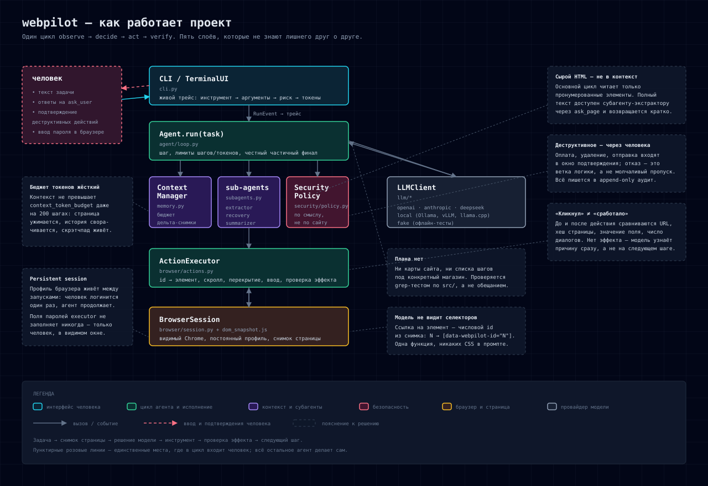
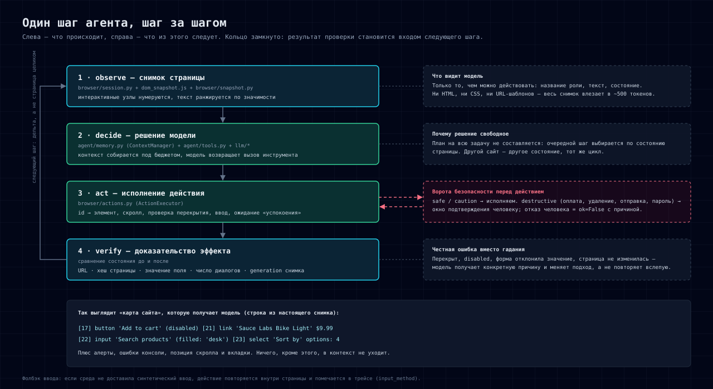

# Архитектура



*Рис. 1 — схема целиком, с пояснениями к каждому решению (та же картинка в README).*

## Идея в одном абзаце

Агент работает циклом **observe → decide → act → verify**, без заранее заданного плана и без
знания о конкретных сайтах. На каждом шаге он видит не HTML, а компактный *снапшот страницы* с
пронумерованными интерактивными элементами, выбирает один инструмент, а после выполнения
инструмент обязан **сам доказать, что подействовал** (сравнение состояния страницы до и после).
Всё, что может быть необратимым, проходит через слой безопасности и подтверждение человека.
Ограничения по токенам держатся бюджетом, а не надеждой на короткую задачу.

```
            ┌──────────────────────────── CLI / TerminalUI (cli.py) ────────────────────────────┐
            │  живой трейс: вызовы инструментов с аргументами, риски, подтверждения, токены      │
            └───────────────▲────────────────────────────────────────────────────────────────────┘
                            │ RunEvent
   человек ──────────────►  │            ┌────────────────────────────┐
   (инструкции, ответы,     └────────────┤  Agent.run(task)  loop.py  │
    подтверждения, логин)                └───┬────────┬───────────┬───┘
                                             │        │           │
                       ┌─────────────────────┘        │           └─────────────────────┐
                       ▼                              ▼                                 ▼
        ┌───────────────────────────┐   ┌──────────────────────────┐    ┌──────────────────────────┐
        │ SecurityPolicy            │   │ ContextManager           │    │ Sub-agents               │
        │ security/policy.py        │   │ agent/memory.py          │    │ agent/subagents.py       │
        │ классификация по смыслу,  │   │ бюджеты, дельта-снапшоты,│    │ extractor / recovery /   │
        │ подтверждение, аудит JSONL│   │ окно шагов, свёртка,     │    │ summarizer (свои         │
        └───────────────────────────┘   │ скрэтчпад notes          │    │ контексты и бюджеты)     │
                                        └──────────────────────────┘    └──────────────────────────┘
                       │
                       ▼ ToolCall
        ┌──────────────────────────────────────────┐        ┌──────────────────────────────────┐
        │ ActionExecutor (browser/actions.py)      │        │ LLMClient (llm/)                 │
        │ проверка эффекта каждого действия;       │        │ openai | anthropic | deepseek |   │
        │ нативный ввод → фолбэк в странице        │        │ local (OpenAI-совместимый) | fake │
        └───────────────┬──────────────────────────┘        └──────────────────────────────────┘
                        ▼
        ┌──────────────────────────────────────────┐
        │ BrowserSession (browser/session.py)      │  persistent context, видимое окно
        │  └─ dom_snapshot.js → snapshot.py        │  интерактивные узлы → data-webpilot-id
        └──────────────────────────────────────────┘  → компактный PageModel (в бюджете токенов)
```

## Границы ответственности

| Слой | Файлы | Отвечает за | Не знает про |
|---|---|---|---|
| браузер | `browser/{session,snapshot,actions,dom_snapshot.js}` | видимый браузер и постоянный профиль, снапшот страницы, исполнение и верификация действий | LLM и политику безопасности |
| провайдеры | `llm/{base,openai_provider,anthropic_provider,local_provider,registry}` | транспорт, ретраи, учёт usage, схемы инструментов | страницы и логику инструментов |
| цикл | `agent/{loop,tools,prompts,memory,subagents}` | шаг, инструменты, контекст и бюджеты, субагенты | конкретные сайты и шаги задач |
| безопасность | `security/{policy,audit}` | классификация риска, подтверждения, аудит | как именно исполняется действие |
| вход | `cli.py` | трейс, ввод человека, вопрос `ask_user`, подтверждения | внутренности цикла |

Разделение даёт офлайн-тесты без сети и ключей: браузер проверяется на локальном тест-сайте,
провайдеры — на canned-JSON, цикл — на стаб-исполнителе и scripted-модели.

## Поток данных одного шага



*Рис. 2 — один шаг: наблюдение, решение, действие, проверка. Справа — что из этого следует.*

1. `ActionExecutor`/`BrowserSession` снимает страницу: `dom_snapshot.js` помечает интерактивные
   узлы (`data-webpilot-id=N`) и отдаёт сырые данные.
2. `snapshot.build_page_model` собирает `PageModel` (элементы, алерты, ранжированный текст,
   скролл, вкладки, ошибки консоли) и `render_page_model` ужимает её под бюджет токенов
   (на первом шаге `full`, дальше `delta` от предыдущего состояния).
3. `ContextManager` собирает запрос: системный промпт, задача, конспект старых шагов, скрэтчпад
   `notes`, окно последних шагов, текущий блок страницы — всё под общим бюджетом.
4. Провайдер возвращает текст и `tool_calls`. Вызовы `ask_page`/`notes` выполняются локально
   (экстрактор и память), остальные идут в executor.
5. `SecurityPolicy.classify` решает, чем является действие: `safe | caution | destructive`.
   Для `destructive` вызывается `ui.confirm` — отказ возвращается модели как неудача, а не
   молча пропускается, и попадает в аудит.
6. Executor разрешает `element_id` в `[data-webpilot-id=N]` внутри нужного фрейма, скроллит к
   элементу, проверяет перекрытие и disabled, выполняет действие и **сравнивает состояние
   до/после** (URL, хеш страницы, значение поля, число диалогов). Если изменений нет — возвращает
   `ok=False` с конкретной причиной и подсказкой («элемент перекрыт», «disabled», «форма
   отклонила значение»), а не «успех» с сомнительным эффектом.
7. Результат превращается в `ToolResult` со свежим `PageModel`, шаг пишется в `StepRecord`,
   событие уходит в UI и в JSONL-транскрипт.
8. Повторяющиеся отказы уходят в recovery-субагента (альтернативные действия), повтор одного и
   того же состояния страницы — предупреждение о цикле, лимиты шагов/токенов — честный частичный
   ответ со списком того, что не получилось.

## Ключевые решения и почему именно так

* **Адресация только числовым id.** Модель вообще не видит CSS: снайфер выдаёт `N`, а
  `selector_for(N)` — единственное место, где id превращается в селектор. Это одновременно
  закрывает требование «никаких захардкоженных селекторов» и снимает целый класс ошибок
  (модель не может «угадать» селектор — его просто нет в её контексте).
* **Снапшот вместо HTML.** Замеры (`docs/RESEARCH.md`, `scripts/measure_perception.py`) показали
  16–56-кратную разницу; сырой HTML при этом ещё и хуже по сигналу, потому что 90 % токенов —
  разметка, а не то, на что можно нажать.
* **Верификация вместо доверия.** «Инструмент вызван» ≠ «страница изменилась». Проверка дешёвая
  (хеш страницы и счётчик мутаций берутся на стороне страницы) и превращает галлюцинации в
  исправимые ошибки, о которых модель узнаёт сразу.
* **Подтверждения как ветка логики, а не как UI-украшение.** Отказ человека возвращается модели
  как неуспех с причиной, поэтому агент ищет другой путь, а не «проскакивает» мимо запрета.
* **Пароли не вводит модель никогда.** Поля `type=password` запрещены к заполнению на уровне
  executor'а (клик и ввод), человек входит в видимом браузере, сессия остаётся в постоянном
  профиле — это и есть требуемый «persistent session».
* **Контекст-менеджер с явными стратегиями, а не «обрезать по длине».** См. `docs/CONTEXT.md`:
  восемь независимо тестируемых механизмов, включая свёртку старых шагов субагентом и
  скрэтчпад, который переживает любую компакцию.
* **Фолбэк ввода.** Если среда не доставляет синтетический ввод в страницу, executor замечает
  отсутствие эффекта и повторяет действие внутри страницы, помечая это в трейсе
  (`input_method`). Разбор гипотез — `docs/RESEARCH.md`, §8.

## Инварианты, закреплённые тестами

* **Никаких селекторов и подсказок по сайтам в коде.** Проверяется grep-тестом по `src/`.
* **Плана нет.** Нет списка шагов под конкретную задачу; модель видит только инструменты и
  текущее состояние.
* **Сырой HTML не попадает в контекст основного цикла** — только в субагента-экстрактора.
* **Каждое действие верифицируется** (URL/хеш/значение до и после).
* **Бюджет токенов жёсткий:** контекст-менеджер не превышает `context_token_budget` — есть
  стресс-тест на 200 шагов.
* **Деструктивное — только с человеком**, кроме явных `--confirm-mode allow` и домена из
  allow-списка, и всегда с записью в аудит.

## Что сознательно не усложнялось

* Нет reflection-циклов на каждый шаг (voting/self-consistency): втрое дороже при небольшом
  выигрыше — вместо этого дешёвая верификация состояния и recovery по факту ошибки.
* Нет OCR и обхода капчи: честнее остановиться и позвать человека.
* Vision не основной канал восприятия: скриншоты сохраняются как артефакт для человека, а
  выборочный доступ к тексту страницы отдан экстрактору.
